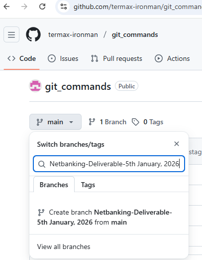

# git_commands

### git init
It creates a .git directory (not a file) which stores all Git metadata (history, branches, config).
### git add .
it adds all the files from working directory to staged directory
### git commit -m "Commit Messege"
it adds staged files to local repository
### git branch -m main
Renames the current branch to main.
### git remote add origin ".git html link"
Adds a remote repository URL named origin that points to the GitHub repo.
### git push -u origin main
Pushes commits from the local main branch to the remote origin repository and sets upstream tracking.
### git config --global user.name "termax-ironman"
### git config --global user.email "youremail@gmail.com"
These commands define author information for commits.
GitHub uses this email to associate commits with your GitHub account.
### creating multiple files on git bash 
touch test1.java 
touch test2.java 
touch test3.java 

git add test1.java (add 1 file to staged status)

now you thought you don't want to commit and want it back 
to working unstaged directory rather than keeping it in staged 
then you need to use this command to back it in unstaged directory(working directory)

git restore --staged  test1.java

now how to check it moved or not?

git status

all 3 files will be red(unstaged) status

if you want to include all 3 files to staged then 

git add .

now you want them back to unstaged rather than commit and push  

git restore --staged .

## Kand Ho Gaya? Ed-1 

your local repo currently in sync with central repo 
you changed test1.java file mistakenly 
now you want to undo the unintended changes from git bash to make it again sync with central repo 
how you can do it?

git restore test1.java

### there is another dev(Dev2) in your org who wants central repo code in his/her system?

git clone ".git link"

### Dev2 do changes in test1.java, test2.java and test3.java file then push it to central repo how you will take that code from central repo?

git pull

### How to check each commmits in central repository?

git log

### how to check each commits on any particular file?

git log test1.java

### how to check each commits on all files in single line? (Fancy Command)

git log --oneline

first 7 digits of commit log are only fetched in this case

### how to check each commits on any particular file in single line? (Fancy Command)

git log --oneline test1.java

### How to create and Resolve conflicts?

you have Test1.java file inside that you(dev1) wrote  
public class Test {  
public static void main(String[] args) {  
System.out.println("Heelo from Dev1");  
} 

then you did
git add test1.java
git commit -m "dev1 test1.java updation"
git push

now another new team member comes and cloned that repo 
then change the test1.java file content to 

public class Test {  
public static void main(String[] args) {  
System.out.println("Hello from Dev2");  
} 

now he add, commit and push that code to cloud
then dev1 joined next day and he opened his local 
test1.java without git pull and added few lines of code in test1.java
now he did these commands 
git add test1.java 
git commit -m "dev1 change" 
git push

now dev1 will get error as REJECTED.....
due to merge conflicts..
now opens the test1.java file and check for log id 
and then he search that log id assocaiated developer with 

git log test1.java

then dev1 will call dev2 and discussed and come into conclusion about 
how much code need to stay and how much need to be discarded

then dev1 will do add,commit and push of that mutually discussed code

That's how mere conflict will get resolved in real time

### How you can only take code from central remote repo to local repository?

git fetch

### how you can take code from local repo to current working tree?

git rebase

## IN SHORT GIT PULL = GIT FETCH + GIT REBASE

### git stash HOW TO USE and when to use?

your team lead gave you task to write a feature and test a feature due to bug at today 1:00PM
and that task(task123/Bug123) need to be completed by tommorow @10:00AM 
but after lunch break at 3:00pm he assign you another task(task456/Bug456) and 
told ou to complete it by 5:30PM today on a urgent basis

Now you already started working on task123/Bug123 since 1:00 pm to 3:00pm
now you want to finsh another task task456/Bug456 

so now you just apply command   

git add task123.java  
git stash  

this will move your task123/Bug123 to temporary location 
you can see the stashed work using

git stash list

now you will continue to work on task456/Bug456 then commit and push that code by 
5:300pm

after that you need unfinished task123/Bug123 task in your working tree

git stash apply

work on that file then git add commit and push the code

if you want any particular stash that you need to work the 
first see that stash using git stash list then use
git stash apply stashid.

### How to move your commited code from local repo to unstaged working tree?

create a file on git bash window

touch file1.java

then do
git add file1.java
git commit -m "created file1"

now if you want to move this file to staged area then do

git reset --soft HEAD~1

if you want it to unstaged working tree

git reset --mixed HEAD~1

or if you want to discard everything and want to start creating fresh
files

git reset --hard HEAD~1

resets your code to the previous local commit.

**soft = keep staged, mixed = keep unstaged, hard = keep nothing**

### Branching

Master (or main) branch is the production/live branch,
Our application always goes live from the Master branch.
You have existing base code in the Master repository.

Imagine you are a developer in the Netbanking team.
Your Team Lead wants you to add a few changes to the BankAccountBalance Java file.

Then the Team Lead goes to GitHub and clicks Create Branch.

He types the branch name based on when this feature needs to be merged from the Netbanking team.
Then he informs you to take a clone of that branch in your local repository and start working on it.

You, as a developer, will do:

git clone -b "Netbanking-Deliverable-5th January, 2026" ".git link"

Now add the new file and perform git add, git commit, and git push.

On 5th January, the Team Lead sees your deliverable on GitHub.
Then he clicks Compare & pull request → Create pull request → Merge to merge the code into the Master branch.

That’s how all the operations are completed.

### Branching with GIT Commands - 

You are a developer working on Banking App
Now you need to create a folder structure and take a clone from
central repo
then you create a branch out that main branch using

git branch payment

you will switch you head from main to payment branch using 

git checkout payment

now you will work on payment feature and you added p1.java 

touch p1.java 
git add . 
git commit "p1.java has been added" 
git push -u origin payment 

now you inform your Team Lead about the feature is ready to merge

your TL open his git bash and typed these commands - 

git branch 
main 
payment 

git checkout main 
git merge payment 
git push 

Now by this time your p1.java will be added to the main branch of the code

### Can you merge one branch into another(without main)?

yes

following up the previous one you opened your laptop and performed below commands -  

git branch 
main 
payment 

git checkout payment 
git branch Payment-New-Feature-Jan 
git checkout Payment-New-Feature-Jan 
touch pn1.java 
git add . 
git commit -m "payment new feature has been updated" 
git push -u origin Payment-New-Feature-Jan 
git checkout payment 
git merge Payment-New-Feature-Jan 
git push 

that's how you can merge one branh code to another.

### What's the difference between Rebase and Merge?

if you created a project with m1.java
then you create a branch sales out of that main
then you add s1.java in sales branch 
meanwhile you realized you forgot to add m2.java in main while crating the base project
git commands - 

git init 
touch m1.java 
git add . 
git commit -m "m1.java has been added" 
git branch sales 
git checkout sales 
touch s1.java 

--now you realized to add m2.java in master/main branch, you do

git checkout master 
touch m2.java 
git add . 
git commit -m "m2.java has been added" 
git checkout sales 
git merge master 

the difference is log commit history of after these two commands

if you do git merge master then you will get appropriate order of log commit history
but while you git rebase master you get wrong and manipulative log commit history

**Rebase rewrites commit history to make it linear, while merge preserves the original branching history.**

Another big difference is a bit descriptive in real world frequently used scenario - 

Called a Rebase Activity
you have january-feature release on spring 1
sprint 1 contains 
few branches 
Main branch --> Test Branch --> QA Branch --> Release Branch --> Client side UAT Testing branch --> prod or live banch or read only branch

this above process is sprint 1 after release you program manager tell you
there is huge defect are being issued need code fixes on the january release
then he told you to create january-feature-defect branch and work on that it will go 
to rebase with last january release branch on 8th february.

now in this case you will use below commands

git branch 
main 
january-feature 

git branch -b january-feature-defect 
git checkout january-feature-defect 
touch d1.java 
git add . 
git commit -m "fixed" 
git push -u origin january-feature-defect 

you are asked to do rebase activity on 8th february morning - 

git checkout january-feature-defect 
git rebase origin/january-feature 
git push -u origin january-feature-defect 

now january-feature-defect branch has d1.java file in remote but 
january-feature has no d1.java file in remote

so to get the file in january-feature beanch you need to complete whole sprint life cycle on 
january-feature-defect branch then you will able to do merge operation in
january-feature branch to get the d1.java code in released production branch.

that's how you do rebase.

### .gitignore file

you can add extentions, filenames, folder names etc. in the .gitignorefile
that means when you push your local changes to remote that mentioned files/folders will not
be avaialble in the remote repository.

create .gitignorefile
inside that you need to add 

*.class
/target/
.project

Files mentioned in .gitignore will not be tracked by Git, 
so they will never be added or pushed to the remote repository.

### Git switch vs Git Checkout

Git switch is used to only do the switching between branches

git branch  
main
Payments

git switch Payments
git switch main

git checkout is also used to switch between branches but it's more than that 
you can just jump from one commit to another commit like restore 

git checkout commit-id --filename
